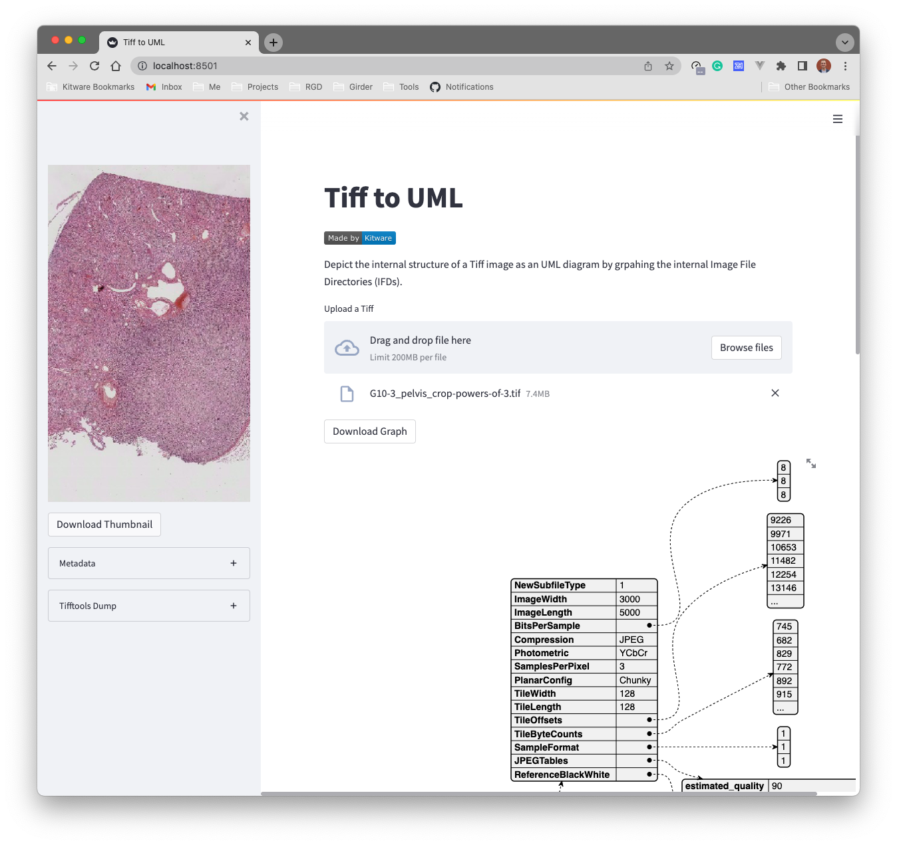

# Tiff to UML

[](https://www.kitware.com/)

This is a script to depict the internal structure of a Tiff image as an UML
diagram. This will grpah out the internal Image File Directories (IFDs).

Usage:

```bash
python tiff_to_uml.py --help
```

```bash
python tiff_to_uml.py --dest uml.png source.tiff
```

## Connections

- [tifftools](https://github.com/DigitalSlideArchive/tifftools)
- [large_image](https://github.com/girder/large_image)

## Streamlit App

For conveinance, we have also included a streamlit app that can be used to
upload an image and graph its structure


